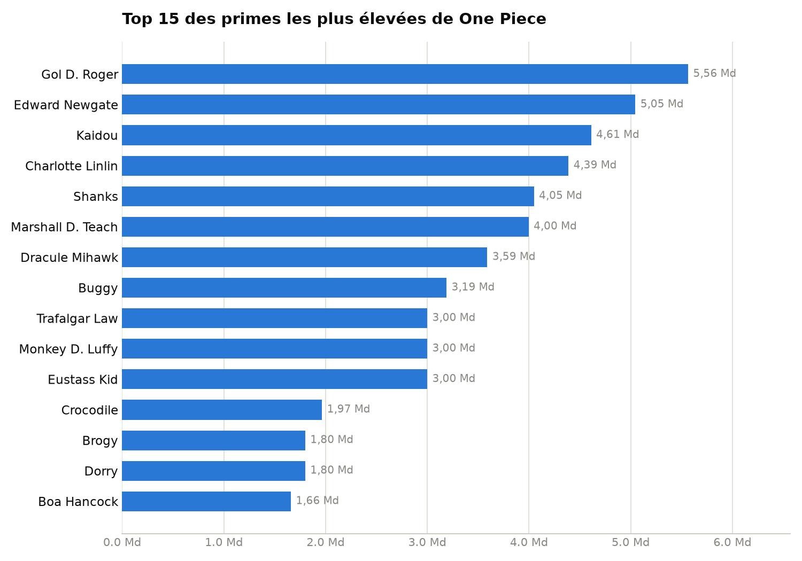
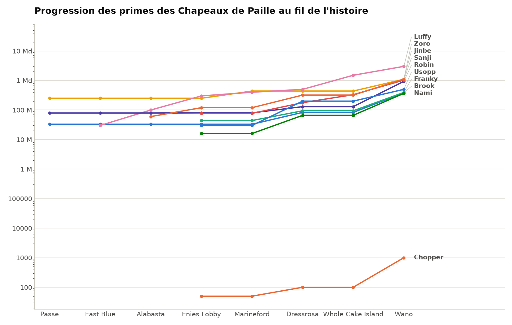

# Analyseur de primes — One Piece

Analyse de données (pandas + matplotlib) sur les primes ("bounties") des
personnages de One Piece : qui a la plus grosse prime, et comment celle des
Chapeaux de Paille a évolué au fil de l'histoire.

## Graphiques

**Top 15 des primes les plus élevées**



**Progression des primes des Chapeaux de Paille au fil des arcs**



## D'où viennent les données

Il n'existe pas d'API officielle pour les primes de One Piece. Les valeurs
viennent du [One Piece Wiki](https://onepiece.fandom.com/wiki/List_of_Bounties),
compilées à la main dans `primes.csv` (105 personnages, dernière prime connue
de chacun) et `progression.csv` (historique complet des 10 Chapeaux de Paille,
prime à prime, arc par arc).

Deux limites assumées :
- Les primes marquées "au moins X" sur le wiki sont entrées telles quelles
  (valeur plancher, pas la valeur exacte si elle est plus élevée).
- `primes.csv` couvre les personnages nommés des équipages majeurs (~105),
  pas l'intégralité des primes mentionnées dans la série (plusieurs centaines
  en comptant les figurants) — un choix délibéré : un graphique à 400 barres
  n'est pas plus lisible qu'un extrait pertinent.

## Stack technique

- **pandas** — chargement, tri, pivot (format long → large) et `ffill()` pour
  propager la dernière prime connue entre deux mises à jour
- **matplotlib** — deux graphiques : un classement en barres horizontales, une
  courbe de progression multi-personnages en échelle logarithmique (nécessaire
  vu l'écart de 50 à 3 milliards entre les primes)

## Installation

```
python -m venv venv
venv\Scripts\activate      # Windows
source venv/bin/activate   # Mac/Linux
pip install pandas matplotlib
```

## Lancer l'analyse

```
python explore.py              # exploration des données (head, info, describe, top 15)
python chart_ranking.py         # génère top15_primes.png
python pivot_progression.py     # pivote progression.csv et affiche avant/après ffill
python chart_progression.py     # génère progression_primes.png
```

## Structure du projet

```
analyseur-primes-one-piece/
├── primes.csv                  # 105 personnages, dernière prime connue
├── progression.csv               # historique des primes, Chapeaux de Paille
├── explore.py                      # premier regard sur les données
├── chart_ranking.py                  # top 15 en barres horizontales
├── pivot_progression.py                # format long -> large, ffill
└── chart_progression.py                  # courbe de progression (échelle log)
```
